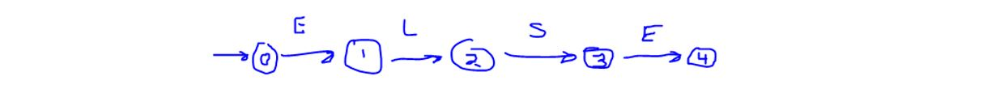
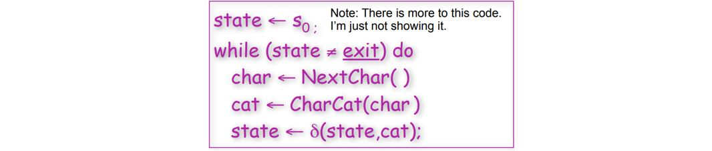
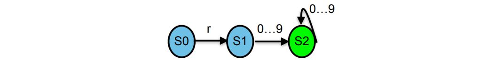

# Module 1

__Compilers__ are _translators_
* translate between representations of program code
* typically: from high-level source language to machine language (object code)

* __NOT__ all compilers translate to machine code
  * Java compiler: translate java code to interpretable JVM bytecode
  * Java JIT: bytecode to machine code

---

* compilers are __NOT__ necessary to execution of all program code
  * programs can be simulated using an __interpreter__: a program that reads an executable program and produces the results of executing that program.

* in certain instances, interpreters execute instructions more slowly than compiled code, depending on the type of program

* executable files are typically written in either a machine code or a bytecode
  * __Machine Code__: targets a specific processor architecture (`ARM64`, `x86_64`, `SPARC`, ...); the case for `C`, `C++`, `Golang`, ...
    * one portion of the executible file contains the translated code that is not represented as binary that is run directly by the process
    * Machine code normally results in better performance (+) at the cost that it won't run on other architectures (not portable (-))
  * __Bytecode__: targets a specific processor architecture (`ARM64`, `x86_64`, `SPARC`, ...); the case for `Java`, `C#`, ...
    * reqires a virtual machine to run the code on a specific architecture
    * as long as there is a virtual machine for that specific architecture then you can execute that code. This makes it more portable (+) at the cost of performance (-) since there is a layer between the code and the processor

---

## Compiler Input: soure code

source code is optimized for human readability
* uses human notations of grammar to be more _readable_, _expressible_ (+)
* Redundant to help avoid programming errors
* Final result may not be fully determined by the code (for example, code that defines a function describes logic given an input)

## Compiler Output: Assembly/Machine Code

Assembly / Machine Code is optimized for hardware
* ambiguity is reduced (+) 
* reasoning about what the code is doing is lost (-) 

## Compiler Output: Optimized vs Unoptimized

* the compiler also makes attempts to shorten the lines of assembly / machine code
* this is an attempt to improve performance

---

## Compiler Translations

how does a compiler effectively translate high-level source code to low-level machine code?
* at the lowest level, a computer only knows about the binary encodings of 1s and 0s, which represent hardware instructions and data
* a compiler translates the original source code into different program representations known as __intermediate representations__
  * these representations are designed to support the necessary program manipulations:
    * __type checking__
    * __static analysis__
    * __optimization__
    * __code generation__

---

## Anatomy of a Compiler

At a high level, a compiler contains two parts:
* __front end: analysis__
  * analyze the source code and determine its structure and meaning to generate an intermediate representation
* __back end: synthesis__
  * generate low-level code for the target platform

A compiler must
* recognize legal (and complain about illegal) programs
* must generate correct code
  * it may attempt to improve ("optimize") code, but must not change a code's behavior ("meaning")
* must manage storage of all variables (and code)
* must agree with OS & linker on format for object code

Each phase of the compiler uses __intermediate representation(s) IR__ to pass along results from its phase to another
* Front end maps source into an IR
* Back end maps IR to target machine code
* Compilers do often have multiple IRs - higher at first, lower level in later phases

### Front End

The front end of a compiler contains two parts:
* __Lexer__: (also known as a __Scanner__) maps character stream into a token stream (keywords, operators, variables, constants, etc)
  * also removes all white space and comments
* __Parser__: reads in the tokens from the token stream and generates an IR
  * also performs semantic analysis to check for type errors, etc.

Both components can be automatically generated
* define a formal grammar to specify the source language
* an existing software tool will read the grammar and generate a scanner and parser (e.g. __ANTLR__ for C/C++, Java, Python, Go, or __flex/bison__ for C/C++)

### Scanner

Example:
* input source code: `if (x==y) x=45`
* character stream:  `i, f,  , (, x, =, =, y, ),  , x, =, 45, ;`
* token stream:      `IF, LPAREN, ID(x), EQ, ID(y), RPAREN, ID(x), ASSIGN, INT(45), SCOLON`

* __Tokens__ are distinct objects that can carry associated data with them (e.g. numeric value, variable name, line, column information, etc.)
* whitespace and comments are not tokens

### Parser

Responsible for taking the token stream and producing an IR output that captures the meaning of the program
* most common output is `Abstract Syntax Tree (AST)`
  * contains meaning of program without syntactic noise
  * internal nodes are operations, and leafs are operands
  * known as the _"natural" IR_
* AST is not the only possible output
  * __Parse Tree__ / __Syntax Tree__ is possible but usually contains additional information that is not needed

Example:
* token stream:      `IF, LPAREN, ID(x), EQ, ID(y), RPAREN, ID(x), ASSIGN, INT(45), SCOLON`
* abstract syntax tree:

### Static Semantic Analysis

A step in the compiler that happens during parsing or directly after parsing to ensure a program is valid
* performs type checking
* verifies code adheres to language semantics (e.g., correct variable declarations)
* performs __code shape__ to determine many properties of the resulting program

Collects additional information for the back end like the __symbol table(s)__ (a __symbol table__ maps names to types)

### Back End

Responsibilities
* Translate IR into target machine code
* Choose instructions to implement each IR operation
* Decide which value to keep in registers
* Ensure conformance with system interfaces

Tries to produce the most "optimal" code
* optimal = fast, compact, low power (can't have them all)

Automation has been less sucessful in the back end

Example:

### Three-Part Compiler

Code Improvement (or Optimization)
* Analyzes IR and rewrites (or transforms) IR
* Primary goal is to reduce running time of the compiled code
* may also improve space, power consumption, ...
* must preserve the "meaning" of the code
* measured by values of named variables

### Optimizer

Typical Transformations
* Discover and propagate some constant value
* Discover a redundant computation and remove it
* Remove useless or unreachable code

Tradeoffs in optimization
* Ordering of optimization phases
* what works for some programs can be bad for others

Modern optimizers are structures as a series of passes

### Creating an executable

many compilers include the `assembler` and `linker` as part of the compiler

### Why study Compilers?

* Compilers are responsible for many aspects of system performance
* attaining performance has become more difficult over time
  * compiler has become a prime determiner of performance

* makes you a better programmer
  * provides insight into interaction between languages, compilers, and hardware
  * allows you to understand how code maps to hardware
  * provides better intuition about what your code does
  * understanding how compilers optimize code helps you write code that is easier to optimize
    * helps with not writing pointless code that "optimizes" the performance when a compiler can do it better

# Module 2

## Lexical Analysis

main objective of lexical analysis is to break the input source code into individual words, known as __tokens__ (or __lexemes__)
* a __lexical token__ is a series of characters that can be treated as distinct objects that can carry associated data with them (e.g. numeric value, variable name, line numbers, etc)
* we use the tokens for the next phase (i.e. parsing)
* a __language__ classifies lexical tokens into __token types__

* lexical analysis _may_ ignore whitespace and comments, or items not required to understand the meaning of the program.

lexical analysis goal (example)
* input source code: `if (x==y) x=45;`
* character stream: `i,f, ,(,x,=,=,y,), ,x,=,4,5,;,`
* token stream: `IF, LPAREN, ID(x), EQ, ID(y), RPAREN, ID(x), ASSIGN, INT(45), SCOLON`

### determining token types

language token types are normally defined for
* __Keywords__ defined in the language (e.g. in golang: `func`, `int`, `if`)
* __Symbols__ that define the overall structure of the language (e.g. in golang: `{`,`}`,`(`,`)`,`+`)
* __Names (identifiers)__ for variables, functions, classes/structs, etc.
* __Categories__ for the type values (e.g. `Int(45)`,`Bool(true)`,`Bool(false)`)

Example:

### Specifying Tokens

* The first step in lexical analysis is determining how we can specify our tokens
* Most compilers use __regular expressions__ to describe programming language tokens
  * a regular expression __R__ defines a regular language __L__, which is a set of strings over some alphabet __Σ__, such as ASCII characters or unicode
    * Each member of the set is known as a __word__ (or __sentence__)
    * __L(R)__ is the "language" defined by __R__
      * `L(xyx) = {"xyz"}`
      * `L(hello | world) = {"hello", "world"}`
      * `L([1-9][0-9]*) = all positive integer constants without a leading 0`
* __Goal__ define a regular expression for each kind of token type and then implement a machine that recognizes words from the language by using those regular expressions

### Regular Expression Fundamental Notation

Given an alphabet __Σ__, the regular expressions over __Σ__ and their corresponding regular expressions are:
* __∅__ denotes the empty set (empty language) 
* __ε__ denotes the empty string
* for each __a__ in __Σ__, __L(a)__ denotes `{a}` the singleton set or the literal set
* __Alternation__: if R denotes L(R) and S denotes L(S) then R | S dneotes any string from either L(R) or L(S)
  * `L(R|S) = L(R) U L(S)`
* __Concatenation__: if R denotes L(R) and S denotes L(S) then RS denotes a string from L(R) followed by a string from L(S)
  * `L(RS) = {rs | r ∈ L(R) ^ s ∈ L(S)}`
* __Kleene star__: if R denotes L(R) then R* denotes zero or more strings from L(R) concatenated together
  * `(ε | R | RR | RRR | RRRR | … )`

Parenthesis `()` can be used to group regular expressions if necessary

Precedence (highest to lowest): parentheses, kleene star, concatenation, alternation

### Convenient Regular Expression Shorthand

The basic regular expression operations can produce all possible regular expressions; however, abbreviations exist for convenience

### Lexical Specification

We can define a __lexical specification__, which defines regular expressions to specify tokens

### Regular Expression Implementation

How do we actually implement from a computer perspective the regular expressions in the specification?
* the beginnings of implementing a lexer (also known as a scanner) for languages is done by first converting regular expressions into __finite automata__.
  * a machine that recognizes patterns
  * given a string __S__, the scanner (i.e. _finite automata_) says "yes" if __S__ is a word of the specified language and says "no" if it cannot determine if it is part of the language
* in order to understand finite automata you must understand transition diagrams

### Transition Diagrams

__Transition Diagram__: flowchart that contains __states__ and __edges__
* each edge labeled with a character
* a subset of states are designated as final (i.e. accepting) states

Transitions from state to state proceed along edges based on the next character from the character stream:

* Every string that ends in a final state is accepted
* if transitioning gets "stuck", there is no transition for a given character, then it is an error
* `"aa"` is not part of the language; `0->1->1` but 1 is not a final state
* `"aaab"`: IS part of the language; `0->1->1->1->2` and 2 is a final state

### Finite Automata

Similar to transition diagrams
* Have states and labelled edges
* One unique start state and potentially one or more final states

Types of finite automata
* __Nondeterministic Finite Automata (NFA)__:
  * Can label edges with `ε`
  * A character can label 2 or more edges out of the same state

* __Deterministic Finite Automata (DFA)__:
  * No edges can be labeled with `ε`
  * A character can label at most one edge out of the same state

* Both NFAs and DFAs will accept a string `x` if there exists a path from the start to a final state labeled with characters in `x`
  * NFA can have multiple paths that could accept x
  * DFAs has only one unique path that could accept x

---
#### NFA example

NFA for the regular expression: `a*ab`

There are many possible moves to accept a string for the regular expression. We only just need one sequence of moves
* e.g. input string: `aaab`

#### DFA example

DFA for the regular expression: `a*ab`

* e.g. input string: `aaab`

DFA for defining `else` keyword in an if-statement

DFA for defining real numbers. must have a dot and at least one digit before and after dot

### Automating Scanner Construction

Goal: we need to convert our regular expressions that represent our tokens into finite autuomata so we can easily execute the scanner to generate the tokens
* steps to convert a lexical specification into code:
1. write down the regular expression(s) for the input language
2. build a big NFA
3. build the DFA taht simulates the NFA
4. Systematically shrink the DFA (not in this course)
5. Turn it into actual code

### Thompson Rules to go from regular expression -> NFA

Use __Thompson construction rules__ to convert regular expressions into NFA form
* always use unique names for all states
* always have at most one final state
* combine your regular expressions with ε-moves

Concatenation `R1R2`:

Alternation `R1 | R2`:

Kleene start `R*`:

Example: convert the regular expression `a(b|c)*` to an NFA using Thompson construction rules
1. do the basic construction for the alphabet of the regular expression (i.e., literals `a`, `b`, and `c`) 

2. use the alteration rule to construct `b | c`, where `R1 = b` and `R2 = c`

3. use the Kleene rule to construct `(b | c)*`, where `R1 = (b | c)*`

4. use concatenation rule to construct `a(b | c)*`, where `R1 = a` and `R2 = (b | c)*`

## NFA -> DFA with Subset Construction

__Subset Construction__ is the algorithm used to reduce an NFA to a DFA

* `n0` is the first state
* `S0` is a set of states
* `S` and `W` are sets of sets of states
* `Move(Si, a)`: the set of states reachable from `Si` by `a`
* `ε-closure(Si)`: the set of states reachable from `Si` by `ε`

* `ε-closure()`: function that takes a set of states (from the NFA), and for each state (in the set), goes to that state (e.g. `n0`), and we try to reach other states by just going along the `ε` edges. If we can, we add those states to the set that will be returned by the function, including the state we started with.

The algorithm halts when:
1. `S` contains no duplicates (test before adding)
2. There is a finite number of NFA states
3. while loop addds to `S` but does not remove from `S` (monotone)
* the loop halts
* `S` and `T` form the DFA

---

Extended example: NFA -> DFA for `a(b|c)*`

1. `Σ={a,b,c}`. `S = {}`. `W = {}`. start with the state that is the starting state of the NFA, `{q0}`. produce the `ε-closure()` on `{q0}`. Can't reach anything with ε edges, so `{q0}` is returned (a set of states), which forms a DFA, which we label `s0`. add `s0` to `S` and `W`. Now, `S == W == {{q0}}`.
2. remove a set `s` from `W`: `{q0}`
3. Now, from the set `s`, for each element in that set, we are going to produce new sets by transitioning from all letters in the alphabet. (for each letter in alphabet) starting with a: from `q0` can we reach others states traversing a edges. Yes: `q1`. so `{q1}` returned by `Move(s,a)`. Now, produce the `ε-closure()` on that set of states: from `{q1}` what states can we reach traversing ε edges: `{q1,q2,q3,q4,q6,q9}`. Now, `t == {q1,q2,q3,q4,q6,q9}`, and we record that in `T[s,a]` (for the set `s`, for the letter `a`).
4. Now:

5. `t ∉ S`, so we add `t` to `S` and `W`. `S = {{q0}, {q1,q2,q3,q4,q6,q9}}. W == {{q1,q2,q3,q4,q6,q9}}`. Let's label this new set `s1`
6. no states reachable traversing edges `b`, `c`.

7. now go back to top of loop and remove another set `s` from `W`: `{q1,q2,q3,q4,q6,q9}` (this is `s1`)

8. starting with a: from any of `q1,q2,q3,q4,q6,q9` can we reach new states transitioning on a edges. no. `Move(s1, a) == ∅`. From any of `q1,q2,q3,q4,q6,q9` can we reach new states transitioning b edges: yes: `Move(s1, b) == {q5}`. Okay now produce the `ε-closure()` on `{q5}`. Can reach `q5,q8,q9,q3,q4,q6`. `t == {q5,q8,q9,q3,q4,q6}`. `t ∉ S` (haven't seen this set), so we add `t` to `S` and `W`. `S = {{q0}, {q1,q2,q3,q4,q6,q9},{q5,q8,q9,q3,q4,q6}}. W == {{q5,q8,q9,q3,q4,q6}}`. This new DFA set will be `s2`. From any of `q1,q2,q3,q4,q6,q9` can we reach new states transitioning on b edges: yes: `Move(s1, c) == {q7}`. Okay now produce the `ε-closure()` on `{q7}`. Can reach `{q7,q8,q9,q3,q4,q6}`. `t == {q7,q8,q9,q3,q4,q6}`. `t ∉ S` (haven't seen this set) so we add `t` to `S` and `W`. `S = {{q0}, {q1,q2,q3,q4,q6,q9},{q5,q8,q9,q3,q4,q6},{q7,q8,q9,q3,q4,q6}}. W == {{q7,q8,q9,q3,q4,q6}}`. This new DFA set will be `s3`. Now:

9. now go back to top of loop and remove another set `s` from `W`: `{q5,q8,q9,q3,q4,q6}` (this is `s2`)

10. starting with a: from any of `q5,q8,q9,q3,q4,q6` can we reach new states transitioning on a edges. no. `Move(s2, a) == ∅`. from any of `q5,q8,q9,q3,q4,q6` can we reach new states transitioning on b edges: yes: `Move(s2, b) == {q5}`. Now, if you produce the `ε-closure()` on `{q5}`, will get `q5,q8,q9,q3,q4,q6`, which will be the same set `q5,q8,q9,q3,q4,q6` (`s2`). `t ∈ S` (have seen this set). don't need to add set to `S` or `W`. Now C. from any of `q5,q8,q9,q3,q4,q6` can we reach new states transitioning on c edges: yes: `Move(s2, c) == {q7}`. Now, if you produce the `ε-closure()` on `{q7}`, will get `{q7,q8,q9,q3,q4,q6}` (`s3`). `t ∈ S` (have seen this set). don't need to add set to `S` or `W`. Now:

11. now go back to top of loop and remove another set `s` from `W`: `{q7,q8,q9,q3,q4,q6}` (this is `s3`)
12. starting with a: from any of `q7,q8,q9,q3,q4,q6` can we reach new states transitioning on a edges. no. `Move(s3, a) == ∅`. from any of `q7,q8,q9,q3,q4,q6` can we reach new states transitioning on b edges: yes: `Move(s3, b) == {q5}`. Now, if you produce the `ε-closure()` on `{q5}`, will get `q7,q8,q9,q3,q4,q6`, which will be the same set `q7,q8,q9,q3,q4,q6` (`s2`). `t ∈ S` (have seen this set). don't need to add set to `S` or `W`. Now C. from any of `q7,q8,q9,q3,q4,q6` can we reach new states transitioning on c edges: yes: `Move(s3, c) == {q7}`. Now, if you produce the `ε-closure()` on `{q7}`, will get `{q7,q8,q9,q3,q4,q6}` (`s3`). `t ∈ S` (have seen this set). don't need to add set to `S` or `W`. Now:

13. finally, `W` is empty, so the loop breaks.

Now, we basically have a DFA. We can ignore the empty sets `∅`.
1. Now, for our DFA we need to figure out what is going to be the accepting states. The accepting states are going to be the states that include the state that is the accepting state within the NFA. 
* `q9` is the accepting state for the NFA.
* So, any state that has q9 within its state is going to be an accepting state. So: `s1, s2, s3` because they all have the final state `q9`.
* Now, can produce the DFA for the NFA representing `a(b | c)*`:

* on the RHS, we have the __transition matrix__
* much smaller than the NFA (no ε transitions)
* all transitions are deterministic (1 character has 1 edge)
* this will be the skeleton for generating the code for our scanner

---

## Coding a Scanner

How can we take a DFA and turn it into code?
* after converting an NFA to a DFA, we can code the DFA (various approaches)

### Scanner: table-driven

implement a __table-driven scanner__ for DFA execution
* make heavy use of indexing
* read the next character
* classify it
* find the next state
* branch back to the top

Example:

input source: `r1 r23 43`
* want to be able to recognize the substrings
* create a table `CharCat(char)` that gives a category to each of the characters within the alphabet:
  * `r` -> Register
  * `0..9` -> Digit
  * `EOF` -> Other
  * `*Other*` -> Other
* create a _delta table_ `δ(state,cat)` which allows for us to signal from a certain state if we see one of these categories we can transition to another state. so, this delta table represents our actual DFA and how we are going to jump states.
* we use two tables to reduce the memory load (could have one giant table, but it is likely to have many repeats / be sparse) 

example:

1. begin at `s0`. trying to reach an exit state (which is only `s2`).
2. start with `r`. go to `CharCat(r)` -> Register. Look at delta table `δ(s0,Register)` -> `s1`. jump to `s1`. Is `s1` a final state? No. get next char
3. next char: `1`. `CharCat(1)` -> Digit. `δ(s1,Digit)` -> `s2`. jump to `s2`. While loop ends because we're at an end (accepting state) (high level)

__Note__: table-driven strategy is not the best because the lookups into the various tables can be expensive and because the memory footprint can be high. Alternative strategy is direct coding.

### Scanner: Direct Coding

* Encode state in the program counter
  * Each state is a separate piece of code
* do transition tests locally and directly branch
* this will generate ugly, spaghetti-like code

So, this will generate ugly code, but it will be performant and not take up as much memory as a table-driven approach.

### Lexical Specification (Ambiguity)

Ambiguity: how do you break up text? is the token stream 1 or 2?
* `elsex =45;`
  * could be `else,x,=,45,;`
  * could be `elsex=,45,;`

* Regular expressions are not enough to handle ambiguity.
* Most languages will choose the longest matching token
  * Longest initial substring of the input that can match a regular expression is taken as the next token
  * Ties in length are resolved by prioritizing the specification
    * in most auto-generated scanners, the way in which you order your expressions are going to solve this problem (listed at the end has lower priority)
* Lexical specification = _regular expressions_ + _priorities_ + _longest-matching token rule_

For handling e.g. keywords vs identifiers, a good solution is to categorize keywords and identifiers as simply identifiers first, and then later use a lookup table to see if the identifier is a keyword. If it is a keyword, it is turned into a keyword.

Or, you can encode the keywords into the DFA

* we're always going to start in the start state. we're going to keep track of a variable called `accept` that is going to represent whether or not this particular state is an accepting state. So, initially set `accept` to an error state `Se`. When we get to an accepting state, we're going to change that state to an accepting state.
* The `lexeme` is going to be the literal associated with your token. You'll have a token type and a literal.
* `count`. Remember we are trying to find the longest matching string, but we can get into a situation where we go past an accepting state by having to grab the longest matching substring, so we will actually will need to go back in the input to the accepting state so that we can continue our processing of our character stream from that point (so this is rolling back when we overshoot from our accepting state). `count` represents how far you go past the accepting state.
* use `goto` statements to go to different states (to branch to different parts of our code).
* use if statements or case statements to represent edges. e.g. `goto s1` will mean going to a different section of code (for state s1); goto `sout` will mean going to the exit state

* may want to have separate dictionary that maps a state to its token. So if `accept == s2`, then you go to your dictionary and see that it corresponds to a Register token, then you create the token and tack on the literal (the lexeme) associated with the token when you are done.

### Hand-coded scanner

many (most?) modern compilers use hand-coded scanners
* starting from a DFA simplifies design and understanding
* avoiding straight-jacket of a tool allows flexibility
  * Computing the value of an integer
    * in LEX or FLEX, many folks use `sscanf()` and touch chars many times
    * can use old assmebly trick and compute value as it appears
  * combine similar states
* Scanners are fun to write
  * compact, comprehensible, easy to debug, ...

### Review

All this technology allows us to automate scanner construction
* implementer writes down the regular expressions
* scanner generator tool builds NFA, DFA, minimal DFA, and then writes out the (table-driven or direct-coded) code
* This reliably produces fast, robust scanners

For most modern language features, this works:
* you should think twice before introducing a feature that defeats a DFA-based scanner (should always try creating the DFA and then coding the DFA...if you don't define your tokens using a DFA approach, you may get into situations where you won't pick up reserved words...won't be as robust, and as the language adds features it will be hard to ensure the scanner will implement it correctly)
* the ones we've seen (e.g. insignificant blanks, non-reserved keywords) have not proven particularly useful or long lasting