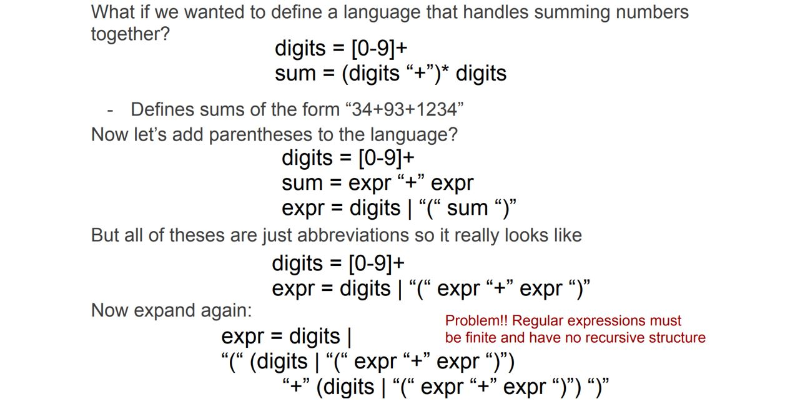

# Module 1

__Compilers__ are _translators_
* translate between representations of program code
* typically: from high-level source language to machine language (object code)

* __NOT__ all compilers translate to machine code
  * Java compiler: translate java code to interpretable JVM bytecode
  * Java JIT: bytecode to machine code

---

* compilers are __NOT__ necessary to execution of all program code
  * programs can be simulated using an __interpreter__: a program that reads an executable program and produces the results of executing that program.


* in certain instances, interpreters execute instructions more slowly than compiled code, depending on the type of program


* executable files are typically written in either a machine code or a bytecode
  * __Machine Code__: targets a specific processor architecture (`ARM64`, `x86_64`, `SPARC`, ...); the case for `C`, `C++`, `Golang`, ...
    * one portion of the executible file contains the translated code that is not represented as binary that is run directly by the process
    * Machine code normally results in <span style="color:blue">better performance (+)</span> at the cost that it won't run on other architectures (<span style="color:red">not portable (-)</span>)
  * __Bytecode__: targets a specific processor architecture (`ARM64`, `x86_64`, `SPARC`, ...); the case for `Java`, `C#`, ...
    * reqires a virtual machine to run the code on a specific architecture
    * as long as there is a virtual machine for that specific architecture then you can execute that code. This makes it <span style="color:blue">more portable (+)</span> at the cost of <span style="color:red">performance (-)</span> since there is a layer between the code and the processor

---

## Compiler Input: soure code

source code is optimized for human readability
* uses human notations of grammar to be more <span style="color:blue">_readable_, _expressible_ (+)</span>
* Redundant to help avoid programming errors
* Final result may not be fully determined by the code (for example, code that defines a function describes logic given an input)


## Compiler Output: Assembly/Machine Code

Assembly / Machine Code is optimized for hardware
* ambiguity is reduced <span style="color:blue">(+)</span> 
* reasoning about what the code is doing is lost <span style="color:red">(-)</span> 


## Compiler Output: Optimized vs Unoptimized

* the compiler also makes attempts to shorten the lines of assembly / machine code
* this is an attempt to improve performance


---

## Compiler Translations

how does a compiler effectively translate high-level source code to low-level machine code?
* at the lowest level, a computer only knows about the binary encodings of 1s and 0s, which represent hardware instructions and data
* a compiler translates the original source code into different program representations known as __intermediate representations__
  * these representations are designed to support the necessary program manipulations:
    * __type checking__
    * __static analysis__
    * __optimization__
    * __code generation__


---

## Anatomy of a Compiler

At a high level, a compiler contains two parts:
* __front end: analysis__
  * analyze the source code and determine its structure and meaning to generate an intermediate representation
* __back end: synthesis__
  * generate low-level code for the target platform


A compiler must
* recognize legal (and complain about illegal) programs
* must generate correct code
  * it may attempt to improve ("optimize") code, but must not change a code's behavior ("meaning")
* must manage storage of all variables (and code)
* must agree with OS & linker on format for object code

Each phase of the compiler uses __intermediate representation(s) IR__ to pass along results from its phase to another
* Front end maps source into an IR
* Back end maps IR to target machine code
* Compilers do often have multiple IRs - higher at first, lower level in later phases

### Front End


The front end of a compiler contains two parts:
* __Lexer__: (also known as a __Scanner__) maps character stream into a token stream (keywords, operators, variables, constants, etc)
  * also removes all white space and comments
* __Parser__: reads in the tokens from the token stream and generates an IR
  * also performs semantic analysis to check for type errors, etc.

Both components can be automatically generated
* define a formal grammar to specify the source language
* an existing software tool will read the grammar and generate a scanner and parser (e.g. __ANTLR__ for C/C++, Java, Python, Go, or __flex/bison__ for C/C++)

### Scanner

Example:
* input source code: `if (x==y) x=45`
* character stream:  `i, f,  , (, x, =, =, y, ),  , x, =, 45, ;`
* token stream:      `IF, LPAREN, ID(x), EQ, ID(y), RPAREN, ID(x), ASSIGN, INT(45), SCOLON`

* __Tokens__ are distinct objects that can carry associated data with them (e.g. numeric value, variable name, line, column information, etc.)
* whitespace and comments are not tokens

### Parser

Responsible for taking the token stream and producing an IR output that captures the meaning of the program
* most common output is `Abstract Syntax Tree (AST)`
  * contains meaning of program without syntactic noise
  * internal nodes are operations, and leafs are operands
  * known as the _"natural" IR_
* AST is not the only possible output
  * __Parse Tree__ / __Syntax Tree__ is possible but usually contains additional information that is not needed

Example:
* token stream:      `IF, LPAREN, ID(x), EQ, ID(y), RPAREN, ID(x), ASSIGN, INT(45), SCOLON`
* abstract syntax tree:


### Static Semantic Analysis

A step in the compiler that happens during parsing or directly after parsing to ensure a program is valid
* performs type checking
* verifies code adheres to language semantics (e.g., correct variable declarations)
* performs __code shape__ to determine many properties of the resulting program

Collects additional information for the back end like the __symbol table(s)__ (a __symbol table__ maps names to types)

### Back End

Responsibilities
* Translate IR into target machine code
* Choose instructions to implement each IR operation
* Decide which value to keep in registers
* Ensure conformance with system interfaces

Tries to produce the most "optimal" code
* optimal = fast, compact, low power (can't have them all)

Automation has been less sucessful in the back end


Example:


### Three-Part Compiler

Code Improvement (or Optimization)
* Analyzes IR and rewrites (or transforms) IR
* Primary goal is to reduce running time of the compiled code
* may also improve space, power consumption, ...
* must preserve the "meaning" of the code
* measured by values of named variables


### Optimizer

Typical Transformations
* Discover and propagate some constant value
* Discover a redundant computation and remove it
* Remove useless or unreachable code

Tradeoffs in optimization
* Ordering of optimization phases
* what works for some programs can be bad for others

Modern optimizers are structures as a series of passes


### Creating an executable

many compilers include the `assembler` and `linker` as part of the compiler


### Why study Compilers?

* Compilers are responsible for many aspects of system performance
* attaining performance has become more difficult over time
  * compiler has become a prime determiner of performance

* makes you a better programmer
  * provides insight into interaction between languages, compilers, and hardware
  * allows you to understand how code maps to hardware
  * provides better intuition about what your code does
  * understanding how compilers optimize code helps you write code that is easier to optimize
    * helps with not writing pointless code that "optimizes" the performance when a compiler can do it better

# Module 2

## Lexical Analysis

main objective of lexical analysis is to break the input source code into individual words, known as __tokens__ (or __lexemes__)
* a __lexical token__ is a series of characters that can be treated as distinct objects that can carry associated data with them (e.g. numeric value, variable name, line numbers, etc)
* we use the tokens for the next phase (i.e. parsing)
* a __language__ classifies lexical tokens into __token types__

* lexical analysis _may_ ignore whitespace and comments, or items not required to understand the meaning of the program.

lexical analysis goal (example)
* input source code: `if (x==y) x=45;`
* character stream: `i,f, ,(,x,=,=,y,), ,x,=,4,5,;,`
* token stream: `IF, LPAREN, ID(x), EQ, ID(y), RPAREN, ID(x), ASSIGN, INT(45), SCOLON`

### determining token types

language token types are normally defined for
* __Keywords__ defined in the language (e.g. in golang: `func`, `int`, `if`)
* __Symbols__ that define the overall structure of the language (e.g. in golang: `{`,`}`,`(`,`)`,`+`)
* __Names (identifiers)__ for variables, functions, classes/structs, etc.
* __Categories__ for the type values (e.g. `Int(45)`,`Bool(true)`,`Bool(false)`)

Example:


### Specifying Tokens

* The first step in lexical analysis is determining how we can specify our tokens
* Most compilers use __regular expressions__ to describe programming language tokens
  * a regular expression __R__ defines a regular language __L__, which is a set of strings over some alphabet __Σ__, such as ASCII characters or unicode
    * Each member of the set is known as a __word__ (or __sentence__)
    * __L(R)__ is the "language" defined by __R__
      * `L(xyx) = {"xyz"}`
      * `L(hello | world) = {"hello", "world"}`
      * `L([1-9][0-9]*) = all positive integer constants without a leading 0`
* __Goal__ define a regular expression for each kind of token type and then implement a machine that recognizes words from the language by using those regular expressions

### Regular Expression Fundamental Notation

Given an alphabet __Σ__, the regular expressions over __Σ__ and their corresponding regular expressions are:
* __∅__ denotes the empty set (empty language) 
* __ε__ denotes the empty string
* for each __a__ in __Σ__, __L(a)__ denotes `{a}` the singleton set or the literal set
* __Alternation__: if R denotes L(R) and S denotes L(S) then R | S dneotes any string from either L(R) or L(S)
  * `L(R|S) = L(R) U L(S)`
* __Concatenation__: if R denotes L(R) and S denotes L(S) then RS denotes a string from L(R) followed by a string from L(S)
  * `L(RS) = {rs | r ∈ L(R) ^ s ∈ L(S)}`
* __Kleene star__: if R denotes L(R) then R* denotes zero or more strings from L(R) concatenated together
  * `(ε | R | RR | RRR | RRRR | … )`

Parenthesis `()` can be used to group regular expressions if necessary

Precedence (highest to lowest): parentheses, kleene star, concatenation, alternation


### Convenient Regular Expression Shorthand

The basic regular expression operations can produce all possible regular expressions; however, abbreviations exist for convenience


### Lexical Specification

We can define a __lexical specification__, which defines regular expressions to specify tokens


### Regular Expression Implementation

How do we actually implement from a computer perspective the regular expressions in the specification?
* the beginnings of implementing a lexer (also known as a scanner) for languages is done by first converting regular expressions into __finite automata__.
  * a machine that recognizes patterns
  * given a string __S__, the scanner (i.e. _finite automata_) says "yes" if __S__ is a word of the specified language and says "no" if it cannot determine if it is part of the language
* in order to understand finite automata you must understand transition diagrams

### Transition Diagrams

__Transition Diagram__: flowchart that contains __states__ and __edges__
* each edge labeled with a character
* a subset of states are designated as final (i.e. accepting) states

Transitions from state to state proceed along edges based on the next character from the character stream:


* Every string that ends in a final state is accepted
* if transitioning gets "stuck", there is no transition for a given character, then it is an error
* `"aa"` is not part of the language; `0->1->1` but 1 is not a final state
* `"aaab"`: IS part of the language; `0->1->1->1->2` and 2 is a final state

### Finite Automata

Similar to transition diagrams
* Have states and labelled edges
* One unique start state and potentially one or more final states

Types of finite automata
* __Nondeterministic Finite Automata (NFA)__:
  * Can label edges with `ε`
  * A character can label 2 or more edges out of the same state

* __Deterministic Finite Automata (DFA)__:
  * No edges can be labeled with `ε`
  * A character can label at most one edge out of the same state

* Both NFAs and DFAs will accept a string `x` if there exists a path from the start to a final state labeled with characters in `x`
  * NFA can have multiple paths that could accept x
  * DFAs has only one unique path that could accept x

---
#### NFA example

NFA for the regular expression: `a*ab`


There are many possible moves to accept a string for the regular expression. We only just need one sequence of moves
* e.g. input string: `aaab`


#### DFA example

DFA for the regular expression: `a*ab`


* e.g. input string: `aaab`


DFA for defining `else` keyword in an if-statement


DFA for defining real numbers. must have a dot and at least one digit before and after dot


### Automating Scanner Construction

Goal: we need to convert our regular expressions that represent our tokens into finite autuomata so we can easily execute the scanner to generate the tokens
* steps to convert a lexical specification into code:
1. write down the regular expression(s) for the input language
2. build a big NFA
3. build the DFA taht simulates the NFA
4. Systematically shrink the DFA (not in this course)
5. Turn it into actual code

### Thompson Rules to go from regular expression -> NFA

Use __Thompson construction rules__ to convert regular expressions into NFA form
* always use unique names for all states
* always have at most one final state
* combine your regular expressions with ε-moves


Concatenation `R1R2`:


Alternation `R1 | R2`:


Kleene start `R*`:


Example: convert the regular expression `a(b|c)*` to an NFA using Thompson construction rules
1. do the basic construction for the alphabet of the regular expression (i.e., literals `a`, `b`, and `c`) 

2. use the alteration rule to construct `b | c`, where `R1 = b` and `R2 = c`

3. use the Kleene rule to construct `(b | c)*`, where `R1 = (b | c)*`

4. use concatenation rule to construct `a(b | c)*`, where `R1 = a` and `R2 = (b | c)*`


## NFA -> DFA with Subset Construction

__Subset Construction__ is the algorithm used to reduce an NFA to a DFA


* `n0` is the first state
* `S0` is a set of states
* `S` and `W` are sets of sets of states
* `Move(Si, a)`: the set of states reachable from `Si` by `a`
* `ε-closure(Si)`: the set of states reachable from `Si` by `ε`

* `ε-closure()`: function that takes a set of states (from the NFA), and for each state (in the set), goes to that state (e.g. `n0`), and we try to reach other states by just going along the `ε` edges. If we can, we add those states to the set that will be returned by the function, including the state we started with.

The algorithm halts when:
1. `S` contains no duplicates (test before adding)
2. There is a finite number of NFA states
3. while loop addds to `S` but does not remove from `S` (monotone)
* the loop halts
* `S` and `T` form the DFA

---

Extended example: NFA -> DFA for `a(b|c)*`


1. `Σ={a,b,c}`. `S = {}`. `W = {}`. start with the state that is the starting state of the NFA, `{q0}`. produce the `ε-closure()` on `{q0}`. Can't reach anything with ε edges, so `{q0}` is returned (a set of states), which forms a DFA, which we label `s0`. add `s0` to `S` and `W`. Now, `S == W == {{q0}}`.
2. remove a set `s` from `W`: `{q0}`
3. Now, from the set `s`, for each element in that set, we are going to produce new sets by transitioning from all letters in the alphabet. (for each letter in alphabet) starting with a: from `q0` can we reach others states traversing a edges. Yes: `q1`. so `{q1}` returned by `Move(s,a)`. Now, produce the `ε-closure()` on that set of states: from `{q1}` what states can we reach traversing ε edges: `{q1,q2,q3,q4,q6,q9}`. Now, `t == {q1,q2,q3,q4,q6,q9}`, and we record that in `T[s,a]` (for the set `s`, for the letter `a`).
4. Now:

5. `t ∉ S`, so we add `t` to `S` and `W`. `S = {{q0}, {q1,q2,q3,q4,q6,q9}}. W == {{q1,q2,q3,q4,q6,q9}}`. Let's label this new set `s1`
6. no states reachable traversing edges `b`, `c`.

7. now go back to top of loop and remove another set `s` from `W`: `{q1,q2,q3,q4,q6,q9}` (this is `s1`)

8. starting with a: from any of `q1,q2,q3,q4,q6,q9` can we reach new states transitioning on a edges. no. `Move(s1, a) == ∅`. From any of `q1,q2,q3,q4,q6,q9` can we reach new states transitioning b edges: yes: `Move(s1, b) == {q5}`. Okay now produce the `ε-closure()` on `{q5}`. Can reach `q5,q8,q9,q3,q4,q6`. `t == {q5,q8,q9,q3,q4,q6}`. `t ∉ S` (haven't seen this set), so we add `t` to `S` and `W`. `S = {{q0}, {q1,q2,q3,q4,q6,q9},{q5,q8,q9,q3,q4,q6}}. W == {{q5,q8,q9,q3,q4,q6}}`. This new DFA set will be `s2`. From any of `q1,q2,q3,q4,q6,q9` can we reach new states transitioning on b edges: yes: `Move(s1, c) == {q7}`. Okay now produce the `ε-closure()` on `{q7}`. Can reach `{q7,q8,q9,q3,q4,q6}`. `t == {q7,q8,q9,q3,q4,q6}`. `t ∉ S` (haven't seen this set) so we add `t` to `S` and `W`. `S = {{q0}, {q1,q2,q3,q4,q6,q9},{q5,q8,q9,q3,q4,q6},{q7,q8,q9,q3,q4,q6}}. W == {{q7,q8,q9,q3,q4,q6}}`. This new DFA set will be `s3`. Now:

9. now go back to top of loop and remove another set `s` from `W`: `{q5,q8,q9,q3,q4,q6}` (this is `s2`)

10. starting with a: from any of `q5,q8,q9,q3,q4,q6` can we reach new states transitioning on a edges. no. `Move(s2, a) == ∅`. from any of `q5,q8,q9,q3,q4,q6` can we reach new states transitioning on b edges: yes: `Move(s2, b) == {q5}`. Now, if you produce the `ε-closure()` on `{q5}`, will get `q5,q8,q9,q3,q4,q6`, which will be the same set `q5,q8,q9,q3,q4,q6` (`s2`). `t ∈ S` (have seen this set). don't need to add set to `S` or `W`. Now C. from any of `q5,q8,q9,q3,q4,q6` can we reach new states transitioning on c edges: yes: `Move(s2, c) == {q7}`. Now, if you produce the `ε-closure()` on `{q7}`, will get `{q7,q8,q9,q3,q4,q6}` (`s3`). `t ∈ S` (have seen this set). don't need to add set to `S` or `W`. Now:

11. now go back to top of loop and remove another set `s` from `W`: `{q7,q8,q9,q3,q4,q6}` (this is `s3`)
12. starting with a: from any of `q7,q8,q9,q3,q4,q6` can we reach new states transitioning on a edges. no. `Move(s3, a) == ∅`. from any of `q7,q8,q9,q3,q4,q6` can we reach new states transitioning on b edges: yes: `Move(s3, b) == {q5}`. Now, if you produce the `ε-closure()` on `{q5}`, will get `q7,q8,q9,q3,q4,q6`, which will be the same set `q7,q8,q9,q3,q4,q6` (`s2`). `t ∈ S` (have seen this set). don't need to add set to `S` or `W`. Now C. from any of `q7,q8,q9,q3,q4,q6` can we reach new states transitioning on c edges: yes: `Move(s3, c) == {q7}`. Now, if you produce the `ε-closure()` on `{q7}`, will get `{q7,q8,q9,q3,q4,q6}` (`s3`). `t ∈ S` (have seen this set). don't need to add set to `S` or `W`. Now:

13. finally, `W` is empty, so the loop breaks.

Now, we basically have a DFA. We can ignore the empty sets `∅`.
1. Now, for our DFA we need to figure out what is going to be the accepting states. The accepting states are going to be the states that include the state that is the accepting state within the NFA. 
* `q9` is the accepting state for the NFA.
* So, any state that has q9 within its state is going to be an accepting state. So: `s1, s2, s3` because they all have the final state `q9`.
* Now, can produce the DFA for the NFA representing `a(b | c)*`:


* on the RHS, we have the __transition matrix__
* much smaller than the NFA (no ε transitions)
* all transitions are deterministic (1 character has 1 edge)
* this will be the skeleton for generating the code for our scanner

---

## Coding a Scanner

How can we take a DFA and turn it into code?
* after converting an NFA to a DFA, we can code the DFA (various approaches)

### Scanner: table-driven

implement a __table-driven scanner__ for DFA execution
* make heavy use of indexing
* read the next character
* classify it
* find the next state
* branch back to the top

Example:

input source: `r1 r23 43`
* want to be able to recognize the substrings
* create a table `CharCat(char)` that gives a category to each of the characters within the alphabet:
  * `r` -> Register
  * `0..9` -> Digit
  * `EOF` -> Other
  * `*Other*` -> Other
* create a _delta table_ `δ(state,cat)` which allows for us to signal from a certain state if we see one of these categories we can transition to another state. so, this delta table represents our actual DFA and how we are going to jump states.
* we use two tables to reduce the memory load (could have one giant table, but it is likely to have many repeats / be sparse) 


example:

1. begin at `s0`. trying to reach an exit state (which is only `s2`).
2. start with `r`. go to `CharCat(r)` -> Register. Look at delta table `δ(s0,Register)` -> `s1`. jump to `s1`. Is `s1` a final state? No. get next char
3. next char: `1`. `CharCat(1)` -> Digit. `δ(s1,Digit)` -> `s2`. jump to `s2`. While loop ends because we're at an end (accepting state) (high level)

__Note__: table-driven strategy is not the best because the lookups into the various tables can be expensive and because the memory footprint can be high. Alternative strategy is direct coding.

### Scanner: Direct Coding

* Encode state in the program counter
  * Each state is a separate piece of code
* do transition tests locally and directly branch
* this will generate ugly, spaghetti-like code

So, this will generate ugly code, but it will be performant and not take up as much memory as a table-driven approach.

### Lexical Specification (Ambiguity)

Ambiguity: how do you break up text? is the token stream 1 or 2?
* `elsex =45;`
  * could be `else,x,=,45,;`
  * could be `elsex=,45,;`

* Regular expressions are not enough to handle ambiguity.
* Most languages will choose the longest matching token
  * Longest initial substring of the input that can match a regular expression is taken as the next token
  * Ties in length are resolved by prioritizing the specification
    * in most auto-generated scanners, the way in which you order your expressions are going to solve this problem (listed at the end has lower priority)
* Lexical specification = _regular expressions_ + _priorities_ + _longest-matching token rule_

For handling e.g. keywords vs identifiers, a good solution is to categorize keywords and identifiers as simply identifiers first, and then later use a lookup table to see if the identifier is a keyword. If it is a keyword, it is turned into a keyword.

Or, you can encode the keywords into the DFA


* we're always going to start in the start state. we're going to keep track of a variable called `accept` that is going to represent whether or not this particular state is an accepting state. So, initially set `accept` to an error state `Se`. When we get to an accepting state, we're going to change that state to an accepting state.
* The `lexeme` is going to be the literal associated with your token. You'll have a token type and a literal.
* `count`. Remember we are trying to find the longest matching string, but we can get into a situation where we go past an accepting state by having to grab the longest matching substring, so we will actually will need to go back in the input to the accepting state so that we can continue our processing of our character stream from that point (so this is rolling back when we overshoot from our accepting state). `count` represents how far you go past the accepting state.
* use `goto` statements to go to different states (to branch to different parts of our code).
* use if statements or case statements to represent edges. e.g. `goto s1` will mean going to a different section of code (for state s1); goto `sout` will mean going to the exit state

* may want to have separate dictionary that maps a state to its token. So if `accept == s2`, then you go to your dictionary and see that it corresponds to a Register token, then you create the token and tack on the literal (the lexeme) associated with the token when you are done.

### Hand-coded scanner

many (most?) modern compilers use hand-coded scanners
* starting from a DFA simplifies design and understanding
* avoiding straight-jacket of a tool allows flexibility
  * Computing the value of an integer
    * in LEX or FLEX, many folks use `sscanf()` and touch chars many times
    * can use old assmebly trick and compute value as it appears
  * combine similar states
* Scanners are fun to write
  * compact, comprehensible, easy to debug, ...

### Review

All this technology allows us to automate scanner construction
* implementer writes down the regular expressions
* scanner generator tool builds NFA, DFA, minimal DFA, and then writes out the (table-driven or direct-coded) code
* This reliably produces fast, robust scanners

For most modern language features, this works:
* you should think twice before introducing a feature that defeats a DFA-based scanner (should always try creating the DFA and then coding the DFA...if you don't define your tokens using a DFA approach, you may get into situations where you won't pick up reserved words...won't be as robust, and as the language adds features it will be hard to ensure the scanner will implement it correctly)
* the ones we've seen (e.g. insignificant blanks, non-reserved keywords) have not proven particularly useful or long lasting

# Module 3

once we have defined tokens (i.e. words) in the code, we need to determine if the structure of the program is correct
* __Parsing__: the phase that determines wheter a program is grammatically (i.e., structurally) well-formed and identifies the function for each component

  * e.g.: english is composed of rules that specify the correct structure for its sentences. The most basic english sentence must be comprised of a _subject_, _verb_, _punctuation mark_: `lamont teaches.`
  * there are also many different rules (i.e. ways) to structure a sentence: _subject_, _verb_, _punctuation mark_ OR _subject_, _verb_, _object_, _punctuation mark_'
  * in general, the english language has a grammar that defines many rules that describe the correct structure for a sentences (and even sometimes with ambiguity). However, these rules allow us to verify the structure is correct

### Motivation for Syntactical Analysis (Parsing)

* at the end of parsing, we will generate a tree structure that will help us in later phases analyze the meaning of the program:


* input source code: `if (x==y) x=45`
* (scanner/"lexer" produces) character stream:  `i, f,  , (, x, =, =, y, ),  , x, =, 45, ;`
* (scanner/"lexer" produces) token stream:      `IF, LPAREN, ID(x), EQ, ID(y), RPAREN, ID(x), ASSIGN, INT(45), SCOLON`
* (parser produces) abstract syntax tree (AST): 


### What does Syntactical Analysis not do?

* type checking
* variable declarations and initializations
* function declarations

example
```golang
var a int 
var b int
b = false // cannot assign b to a value of a different type (b is type int)
c = a + b // cannot use variables that are not declared (c)
```

These are deferred until _semantic analysis_

### Specification of Language Syntax

goal: how can we specify the language syntax precisely and conveniently to make it easy to parse source code?

* _lexical analysis_: used __regular expressions__ to describe tokens. This made it easy to convert them to DFAs and simulated the DFAs to produce the tokens
  * can we use _regular expressions_ alone to specify programming language syntax?
    * __NO__: regular expressions cannot handle _recursion_. _Regular Expressions must be finite and have no recursive structure._



* Languages are not regular and cannot be described by regular expressions
  * DFA has only a finite number of states so adding paranthesis would require some form of counting which is not doable with regular expressions

We need a way to specify nesting or specifying a recursive structure for various proramming language constructs

### Grammars

__Grammar__: a precise, declarative specification of syntactic structure of a language
* the format (notation) of a grammar is usually specified in __Extended Backus-Naur Form (EBNF)__
  * has a set of __rewriting rules__ (also called __productions__)
  * has a set of __non-terminals__ (appear on the LHS of a production)
  * has a set of __terminals__ (token from the alphabet)

example rewriting rules (productions):
* `Stmt` -> __`if`__ `Expr` __`then`__ `Stmt` __`else`__ `Stmt`
* `Expr` -> `Expr` __`+`__ `Expr` | `Expr` __`*`__ `Expr` | __`(`__`Expr`__`)`__ | __`id`__
> vertical bar is shortand for multiple productions
* _non-terminals_ = `Stmt`, `Expr`
* _terminals_ = __`if`__, __`then`__, __`else`__, __`+`__, __`*`__, __`(`__, __`)`__, __`id`__

### Formal Context-Free Grammar

__Formal Context-Free Grammar__: regular expressions with recursion (more expressive than regular expressions)
* defined by __T,N,P,S__:
  * __T__: set of terminals
  * __N__: set of non-terminals
  * __P__: set of productions (rewriting rules)
  * __S__: start symbol (belongs to N)

example `G=(T,N,P,S)`
```
T = {+,*,(,),id}
N = {E}
P = {
  E -> E + E,
  E -> E * E,
  E -> (E),
  E -> id
}
S = E
```

re-writing the productions in `EBNF` form would yield:
```
E -> E + E | E * E | (E) | id
```

example of context-free grammar (CFG): sum grammar on integers
1. context-free grammar
```
S -> E + S | E
E -> INT | (S)
```
2. expanded definition of grammar:
```
S -> E + S
S -> E
E -> INT
E -> (S)

4 productions
2 non-terminals: S, E
4 terminals: ( ) + INT
Start symbol: S
```

Each context-free grammar defines a __context-free language (L)__, which contains all sentences of terminal symbols derived from repeated application of productions from the starting symbol. 
* e.g. example language sentences from the Sun grammar: `(1 + 2), 2, 4 + 21, ((3+3)+5)`

### Derivations

can see if a sentence is part of a language by performing a __derivation__
* example: `3+(17)`
* __sentence__: sequence of non-terminal values
* __derivation__: a test to see if a sentence is a legal sentence for a language (it is legal if it can be derived from the language)
* intermediate forms (`(INT(3) + E)`, `INT(3) + (E)`, etc) always contain non-terminals

__performing a derivation__
1. starting with the start symbol, repeatedly replace a non-terminal using a production rule:
```
// CFG //
non-terminals: S, E
terminals: ( ) INT + *
production rules (4):
1. E -> E + E
1. E -> E * E
2. E -> (E)
3. E -> INT

sentence: 3 + (17)
(apply 1.) => E + E
(apply 3.) => INT(3) + E
(apply 2.) => INT(3) + (E)
(apply 3.) => INT(3) + (INT(17))
```

### Derivation Order

Can choose to apply productions in any order
* for some arbitrary strings `α` and `γ` and a production `A -> β`, a single step of a derivation is
  * `αAγ => αβγ` (substitute `β` for an occurence of `A`)

Two standard orders: _leftmost_ derivation and _rightmost_ derivation
* __Leftmost derivation__: at each step, the leftmost non-terminal is replaced
```
E => E + E
  => INT + E
  => INT + INT
```
* __Rightmost derivation__: at each step, the rightmost non-terminal is replaced
```
E => E + E
  => E + INT
  => INT + INT
```

### Derivation Example

* Derive ((34+3)+4)+9
```
// CFG //
S => E + S | E
E => INT | (S)

productions: 2
non-terminals: S, E
terminals: + ( ) INT 
```

derivation:
```
Left-most derivation
S => E + S
  => (S) + S
  => (E + S) + S
  => ((S) + S) + S
  =>((E+S) + S) + S
  =>((34+S) + S) + S
  =>((34+E) + S) + S
  => ((34+3) + S) + S
  => ((34+3) + E) + S
  => ((34+3) + 4) + S
  => ((34+3) + 4) + E
  => ((34+3) + 4) + 9

Right-most derivation
S => E + S
 => E + E
 => E + 9
 => (S) + 9
 => (E + S) + 9
 => (E + E) + 9
 => (E + 4) + 9
 => ((S) + 4) + 9
 => ((E + S) + 4) + 9
 => ((E + E) + 4 ) + 9
 => ((E + 3) + 4 ) + 9
 => ((34 + 3) + 4) + 9
```

### Derivation to Parse Tree

__Parse Tree__: graphical tree representation of a derviation
* _internal nodes_ are represented with non-terminals
* _leaf nodes_ are represented with terminals
* building a parse tree from a derivation makes the next step of compilation easier
  * performing an in-order traversal yields a sentence from the language
  * non information about order of derivation steps (although we used left-most in the above example)
  * doing a left-most or right-most derivation is not important; they should yield the same parse tree. if they do not yield the same parse tree, the grammar is ambiguous.

example:
```
(34+5)+9 derivation
S => E + S
 => (S) + S
 => (E + S) + S
 => (34 + S) + S
 => (34 + E) + S
 => (34 + 5) + S
 => (34 + 5) + E
 => (34 + 5) + 9
```


### Parse Tree vs Abstract Syntax Tree

* parse tree is also known as "__concrete syntax__"
* an AST is similar to a parse tree but _discards / abstracts out unnecessary information_ (i.e. removes the non-terminals)


### Ambiguous Grammars

__ambiguous grammar__: grammar where we can derive a sentence with more than one leftmost derivation, which produces different parse trees.
```
e.g.
E -> E + E
E -> E * E
E -> INT

consider 1 + 2 * 3

E => E + E
  => 1 + E
  => 1 + E * E
  => 1 + 2 * E
  => 1 + 2 * 3

E => E * E
  => E + E * E
  => 1 + E * E
  => 1 + 2 * E
  => 1 + 2 * 3
```


### Ambiguous Grammars (if-then-else)


### How to Fix an Ambiguous Grammar

Usually can eliminate ambiguity by rewriting grammar to include additional rules and allowing recursion only on the right or left
```
E -> E + T
E -> T
T -> T * F
T -> F
F -> INT

E = Expression
T = Term
F = Factor
```
* Make `*` bind higher than `+` (i.e. `*` has higher precedence than `+`)
* `1 + 2 * 3` means `1 + (2 * 3)` instead of `(1 + 2) * 3`
* build grammar from highest to lowest precedence
* make grammar use (right or left) recursion. In this case we use left-recursion -> left-associativity

example: write out the derivation steps for leftmost and rightmost to see how this tree was produced
```
1 + 2 * 3

leftmost derivation
E -> E + T
  -> T + T
  -> F + T
  -> 1 + T
  -> 1 + T * F
  -> 1 + F * F
  -> 1 + 2 * F
  -> 1 + 2 * 3

rightmost derivation
E -> E + T
  -> E + T * F
  -> E + T * 3
  -> E + F * 3
  -> E + 2 * 3
  -> T + 2 * 3
  -> F + 2 * 3
  -> 1 + 2 * 3
```

### Parsing

> to do parsing, we need the context-free grammar of the lanauge. If we can construct the derivation for the sentence, then the parser can accept that program as being a valid program within the language. Otherwise, it returns an error. A parser is trying to find a derviation for that program.

__Parser__: program that given a sentence constructs a derivation for that sentence
* if it can construct a derivation then it will accept the sentence as part of the language; otherwise, error

* Parsers read their input from left-to-right but may construct the parse tree differently
* __top-down parser__: constructs the tree from root to leaves (algorithms: _recursive descent_, _predictive parsing_, _LL(1)_)
  * grammars have to be formatted in a certain way in order for a top-down parser to work correctly
* __bottom-down parser__: constructs the tree from leaves to root (algorithms: _shift-reduce_, _LR_, _SLR_, _LALR_)
  * LR algorithms are the most commonly used parsing algorithms in modern compilers

### Top-Down Parsing

construct parse tree by starting at the start symbol and "guess" at the derivation step
* can use the next input token to guide in guessing

__recursive descent with backtracking__ is the easiest algorithm to implement. Though, it is probably the least efficient in space-time complexity. predictive-based parsing does a bit more optimally than randomly guessing the next production step.
* can implement top-down parsing using __recursive descent with backtracking__; however, before we do this we must modify the grammar to be __right recursive__
* most top-down parsing algorithms don't handle left recursion very well


* the two grammars above are equivalent. The LHS is written as a left-recursive grammar; the RHS is written as a right-recursive grammar.
* `ε` is the empty string

e.g.
```
using left-recursive grammar
E is the start symbol
E -> E + T
  -> T + T
  -> F + T
  -> 3 + T
  -> 3 + T * F
  -> 3 + F * F
  -> 3 + 4 * F
  -> 3 + 4 * 5

using right-recursive grammar
E is the start symbol
E -> T E'
  -> F T' E'
  -> 3 T' E'
  -> 3 E'    // substitute in epsilon which is "", basically deletion
  -> 3 + T E'
  -> 3 + F T' E'
  -> 3 + 4 T' E'
  -> 3 + 4 * F T' E' 
  -> 3 + 4 * 5 T' E' 
  -> 3 + 4 * 5 E'  // T' => epsilon
  -> 3 + 4 * 5     // E' => epsilon
```

### Recursive Descent algorithm

Lets examine a grammar
```
E  -> T E'
E' -> + T E'
E' -> ε
T  -> F T'
T' -> * F T'
T' -> ε
F  -> INT
```

* for every unique symbol on the RHS of a production, we will have its own single function
  * `E`, `E'`, `T`, `T'`, `F`
* within that function we will decide which production rule to take
  * `E` has one rule. Will apply `T E'`.
  * `E'` has two production rules so we have to choose.
* start with the start symbol and call that token's function

```golang

// E  -> T E'
// E' -> + T E'
// E' -> ε
// T  -> F T'
// T' -> * F T'
// T' -> ε
// F  -> INT

func (p *Parser) nextToken() ct.Token {

	var token ct.Token
	if p.currIdx == len(p.tokens) { // reached EOF. the last token
		token = p.tokens[p.currIdx-1] // keeps returning the last token.
	} else {
		p.currIdx += 1
		token = p.tokens[p.currIdx]
	}
	return token
}

// Parse() returns true if the tokens in the sentence is a valid sentence in the language.
func (p *Parser) Parse() bool {
	p.nextToken() 
	return E(p) // start with the start symbol and call that token's function
}

func E(p *Parser) bool {
	return T(p) && EPrime(p)
}
func EPrime(p *Parser) bool {

	if p.match(ct.PLUS) {
		return T(p) && EPrime(p)
	}
	return true
}
func T(p *Parser) bool {
	return F(p) && TPrime(p)
}
func TPrime(p *Parser) bool {

	if p.match(ct.ASTERISK) {
		return F(p) && TPrime(p)
	}
	return true // this handles T' -> ε
}
func F(p *Parser) bool {

	if p.match(ct.INT) { // does the current token I'm at match an integer?
		return true
	} // may have other else-if statements here (for e.g. E -> INT | ID | ...)
	parseError("expected integer")
	return false
}

func (p *Parser) match(token ct.TokenType) bool {

	if token == p.currToken().Type {
		p.nextToken()
		return true
	}
	return false
}
```

### Example: Cal Language Grammar

EBNF form grammar for simple language: `Cal Language`
* `{ ... }` means zero or more
```
Program = Block 'eof'                       
Block = {Statement}                         
Statement = Let | Assignment | Print        
Let = 'let' 'id' '=' Expression ';'         
Assignment = 'id' '=' Expression ';'        
Print = 'print' Expression ';'              
Expression = Term ExpressionPrime           
ExpressionPrime = '+' Term ExpressionPrime  
ExpressionPrime = '-' Term ExpressionPrime  
ExpressionPrime = 'ε'                       
Term = Factor TermPrime                     
TermPrime = '*' Factor TermPrime            
TermPrime = '/' Factor TermPrime            
TermPrime = 'ε'                             
Factor = 'INT' | 'id'                       
```

# Module 4/5

## Semantic Analysis Overview

__Goal__: determine any remaining issues that would result in an invalid program
* determine if variables are undefined
* statically type checking to ensure types are consistent based on use
* determine uninitialized variables (if required) and unreachable code
  * (unreachable code) e.g. an if-else that has a return statement in both the if and else clause will cause all code after the if-else to be unreachable
* determine useful information for later compiler phases
  * type check expressions
  * memory layout sizes for each variable

| Semantic Information | Produced By | Required By |
|---|---|---|
| constant/variable information | declarations, expressions | expressions, statements |
| type intformation | declarations, expressions | operations |
| register & memory locations | compiler | code generation |

e.g. _type information_
* note: parsing only verifies the structure of a program
* note: semantic analysis verifies meaning of a program (e.g. are two operands of the same type so that this operation is valid)
```golang
var x int; // type information declared here
print(x+4) // type information used to verify operations are allowed (+,print)
```

### Semantic Checks: Identifier

Semantic checks for __identifiers (i.e. variables)__
1. _check_: identifier has been declared and is in the correct scope
2. _check_: the inferred type of the identifier matches its declared type
* __inferred type__: the type that the compiler automatically deduces (partially or fully) during compilation
* __declared type__: the type specified by the programmer when writing the source code for the identifier
* e.g. of invalid program `var y int; y = true`. `y` has declared type `int`. the inferred type looking at the expression is `boolean`

```golang
// parsing complete (correct structure)
// (0) add declaration to symbol table (hash table)
// (1) verify x has already been defined within scope of this function (check symbol table)
func main(){
  var y int;
  y = x + 4; // invalid
}
```

### Semantic Checks: Binary Expression

Semantic checks for __binary expressions__ (`exp1 op exp2`)
1. _check_: make sure that `exp1` and `exp2` are of the same type
2. _check_: that the binary expressions inferred type matches operator and operand types
* e.g. `"Lamont" + 4` is invalid because `+`, based on the language, can only work on two strings (concatenation) or numbers (arithmetic addition)

```golang
// invalid program
func main(){
  var y int;
  var x bool;
  y = 4 + true; // invalid: fails check 1
  x = 4 + 6; // invalid: fails check 2
}
```

### Semantic Checks: Assignment Statement

Semantic checks for __Assignment Statement__ (`exp1 = exp2`)
1. _check_: make sure that `exp1` is assignable (i.e., not an expression or constant, usually variable or struct field)
2. _check_: make sure that `exp1` and `exp2` are of the same type

```golang
// invalid program
func main(){
  var x bool;
  3 = 4 + 6; // invalid: fails check 1
  x = 4 + 6; // invalid: fails check 2
}
```

### Semantic Checks: Field Reference

Semantic checks for __Field Reference__ (`expr.f`)
1. _check_: make sure that `expr` is a reference type (not a primitive type)
2. _check_: make sure that the inferred type is the declared type of `f`

```golang
type Point struct {
  x int
  y int
}

// invalid program
func main(){
  var x bool;
  var t *Point;

  x.x = 4; // fails case 1 because it is a primitive type not a reference type

  t = new Point;
  t.harry = 4; // fails. need to confirm harry is a field of struct
  t.x = true; // fails case 2 because x is declared an int so the inferred type of expression needs to be as well, but it is bool
  t.x = 4; // ok

}
```

### Semantic Checks: Function Calls

Semantic checks for __call__ statement `(f(e1,e2,...,en))`
1. _check_: make sure that `f` is a function defined in the namespace (i.e., scope of the calling function)
2. _check_: make sure each argument (`e1,e2,...,en`) has inferred type that matches the type of its corresponding parameter
3. _check_: inferred (return value) type matches the declared return type of the function

```golang
func foo(y bool) int {
  return 3;
}

func foobar(y bool) int { // fails case 3 bc function return value type does not match return type declared by function
  return true; 
}

func foobar(y bool) int { // fails case 3 bc function has no return value type but function specifies a particular return type
  return;
}

func main() {
  var t int;
  var myvar bool;
  t = bar(); // fails case 1 because bar is not in the namespace of main
  t = foo(); // fails case 2 because parameter list types don't match that in definition
  t = foo(5); // fails case 2 because type for argument does not match specification of the declaration for this particular parameter
  myvar = foo(5); // fails case 3 inferred type (return value) does not match declared type on LHS
}
```

## Symbol Table

### Variable Definitions and Scoping

consider the source code
```golang
var x = 0

func foo(x int) int { // this called "hiding"
  fmt.Printf("<1>x=%v\n", x) // x refers to the parameter (the argument); not x in global scope
  y := x + 3 // 4
  bar := func(x int) int { 
    fmt.Printf("<2>x=%v\n", x) // refers to the inner most scoping for the variable x; 
    z := x + 1 
    return z 
  }
  return y + bar(2) // bar(2) == 3
}

func main() {
  x = foo(1) // e.g. which x is used? the one in the global scope
  fmt.Printf("<3>x=%v\n", x) // which x is used? the one in this scope. hiding
}
```
* whenever a variable appears in a statement,
* we first look to see if that variable has been defined in the local scope
* if the variable has not been declared in the local scope, we look at the global scope (an outer scope)
* when there are two variables with the same name defined in two different scopes (for example `x` defined in the global scope, `x` defined in the local scope), we say that the variable at the inner scope hides the scope of the variable in the global scope.

We need to make sure each variable is defined and check for type consistency. How can we do this?
* Define a symbol table
* Traverse the abstract syntax tree in a specific order while maintaining a data structure that maps a variable -> type

### Symbol Table

Programmatically, a __symbol table__ is a set of (name, attribute) pairs
* Also known as __environments__
* __Names__
  * are typically strings (`“a”`, `“computeAverage”`, `“foo”`)
* __Attributes__ (also know as bindings)
  * Type identifier (`int`, `string`, `bool`)
  * Variable Identifier (_type_, or _value_)
  * Function Identifier (_arguments_, and _result type_)

We build and use symbol tables during the semantic pass
1. build the symbol tables by going through the declarations of the program
2. use the symbol tables to check semantic rules

You may need to augment and use the symbol tables in the later compiler phases (later)
* Main Goal: How do you efficiently look-up and add _(name, attribute)_ pairs to a symbol table?

### Implementation (Symbol Table)

__Hash tables__
* efficient data structure (`O(1) expected` time for search and insertion) but deleting from a hash table can be expensive

__Balanced Binary Trees__
* functional approach that does not need to explicitly "_delete_"; search and insertion is `O(log N)` (see textbook for details)
* we are going to use the imperative approach

### Implementation (Imperative Symbol Table Implementation)

_Define a global symbol table_
* the symbol table will map global variable declarations, function declarations, struct declarations to information about those constructs
* do a single pass over the definitions in the AST
* keep this symbol table around for future phases of the compiler

```golang
var x = 0

type Point2D struct {
  x int
  y int
}

func main() {
  x = 1
}

```


Will want to define various structs to hold convenient information for encountering various information
* __`VarEntry`__: `ty Type`, `location MemoryLocation`
* __`StructEntry`__: will probably have a `[]VarEntry`
* __`FunctionEntry`__

### nested scopes?

How do we handle nested functions or nested scopes? What about nested scopes?
* Generate a new symbol table for inner scopes that is linked to the surrounding scope’s table 
  * Think of this as a stack of symbol tables where the top of the stack is the current innermost scope and the bottom of the stack is the global scope.
  * Look for an identifier in inner scope (top of the stack) and if its not found look in outer scope (recursively)
  * Important: Don’t delete these scopes! Keep these tables around by adding a pointer to the parent scope table.

> example: visual symbol table for code in prior section


### Identifier Errors

_What happens when we encounter an undeclared identifier?_
* Only specify the error once by creating a table entry for it once you identified the undeclared identifier and make a "unknown" entry for it so you know later on if you see it again that you already notified the user of the error
  * this is because you only need to report the error to the user once

### Predefined Declarations

Many languages have predefined declarations that are built into the language
* e.g. functions, constants, standard libraries
* e.g. `append()`

At compiler startup, include initialization code to manually insert these declarations into the global symbol table
* the phases of the compiler do not care about these "predefined" declarations versus the ones defined in the source program

## Types and Type System

* __type__: for an expression tells us the operations that can be applied to the values of that expression
* __type system__: set of typing rules that define what type-consistency means in the language
* __type checking__: ensure programs adhere to the typing rules of the languages
  * _one of the key parts of semantic analysis_

the kinds of type checking:
* __static type checking__: types are checked at compile time
* __dynamic type checking__: types are checked at run time

> e.g. if `+` only meant arithmetric addition, then if an expression types to an `int`, then use of `+` is valid

### Type Safety

Along with languages being classified as static or dynamically typed, they can also be at the same time either strongly or weakly typed
* __strongly typed__: languages have definitive types for their variables. It guarantees no illegal operations are performed
* __weakly typed__: languages have variables that are less highly coupled to a specific type. There's no guarantee that no illegal operations will be performed.
* it can sometimes be hard to categorize languages intot hese categories based on many different meanings of them

* Statically typed, Strongly typed: `Java`, `SML`, `Golang`
* Statically typed,   Weakly typed: `C`, `C++`
  * can define a variable to be equal to a pointer to a specific type, but behind the scenes you can do type casting and pointer arithmetic to modify the type or use the type in a way that is different from how it was originally declared
* Dynamically typed, Strongly typed: `Python`, `Ruby`
* Dynamically typed,   Weakly typed: `Javascript`

### Base Types vs Compound Types

__Base Types__: (also known as fundamental, atomic, primitive types) are provided by (i.e. built-into) the language as a basic building block for other types
* e.g. `int`, real (i.e., `float`, `double`, etc.), `string` (not always), `char`, `bool`

__Compound Types__: built up from other types (sometimes recursively)
* e.g. structs, classes, records, arrays, pointers
```golang
type Node struct {
  data int
  next *Node
}
```

### Type Equivalence

_How do we know if two types are the same?_
* base types are the same if they are identical
* compound types fall into two basic categories
  * __Structural Equivalence (SE)__: two types are the same if their attribute types are recursively equivalent
  * __Name Equivalence (NE)__: two types are the same if and only if they have the same name

```golang
// Equivalent under Structural Equivalence (SE)
// not equivalent under Name Equivalence (NE)
type Point2D struct{
  x int
  y int
}

type Point struct{
  x int
  y int
}
```

### Type Representation

__Important!__: Type nodes are not the same as AST node!
* _AST_: abstract representation of the __meaning__ of the source program
* _Types_: abstract representation of the type semantics for the type system
* make sure to have a separate type system inheritance hierarchy specifically for type checking that is not part of the AST inheritance hierarchy

### Base Type Implementation

create a separate base type struct for each base type (`int`, `bool`, `char`, etc)
* might be useful to make this a singleton (i.e., a single pointer instance that is defined at compiler startup). It will make it easier to do equality checking
* Useful to create a "`void`" type that represents that a function does not return a value
* Useful to create a "`unknown`" type to help handle errors

### Compound Type Implementation
 
Similar to base types, define structs that include information about the field types

```golang
type Type interface{
  //...
}

type StructType interface { // base StructType interface
  Type
}

type structType struct {
  fields map[string]Type
}
```